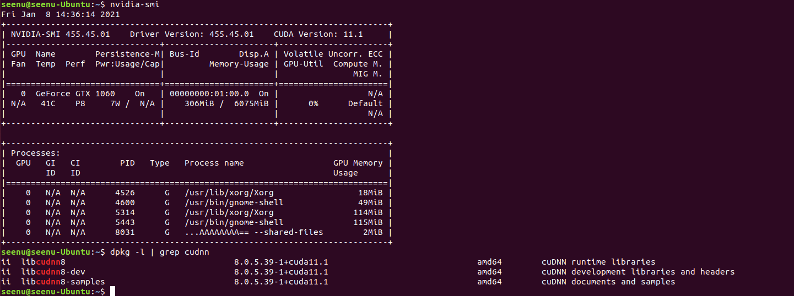
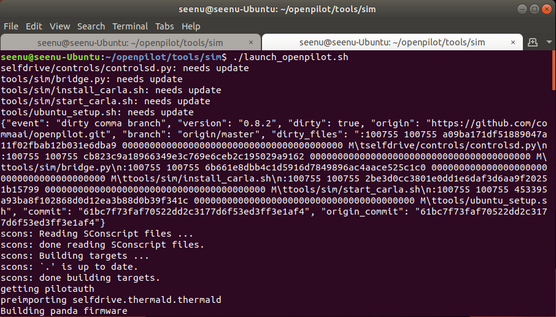
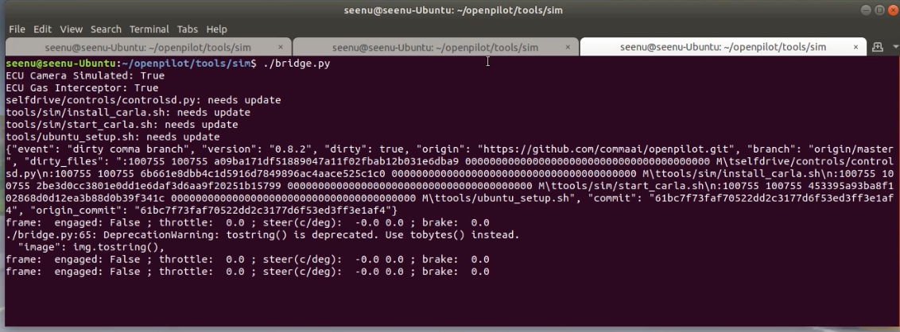
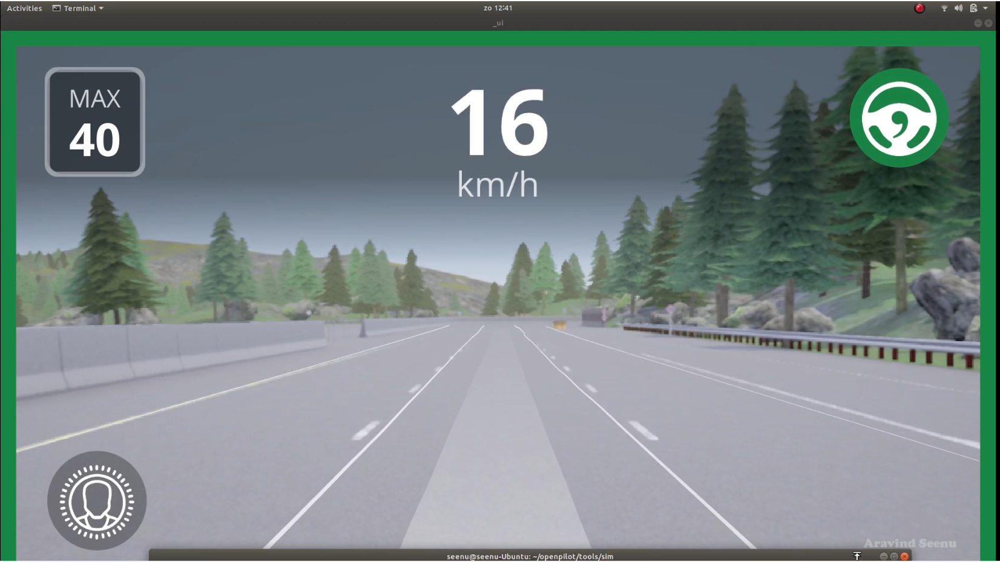
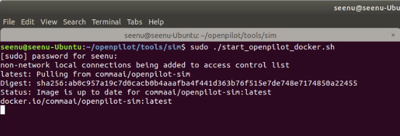
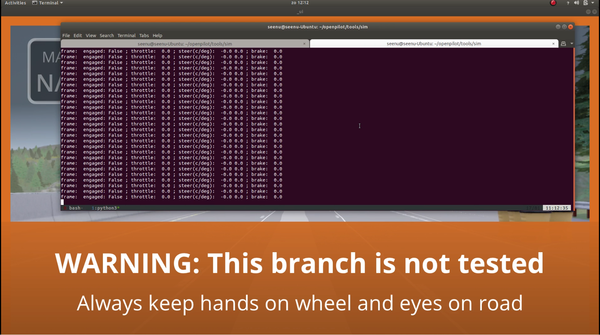
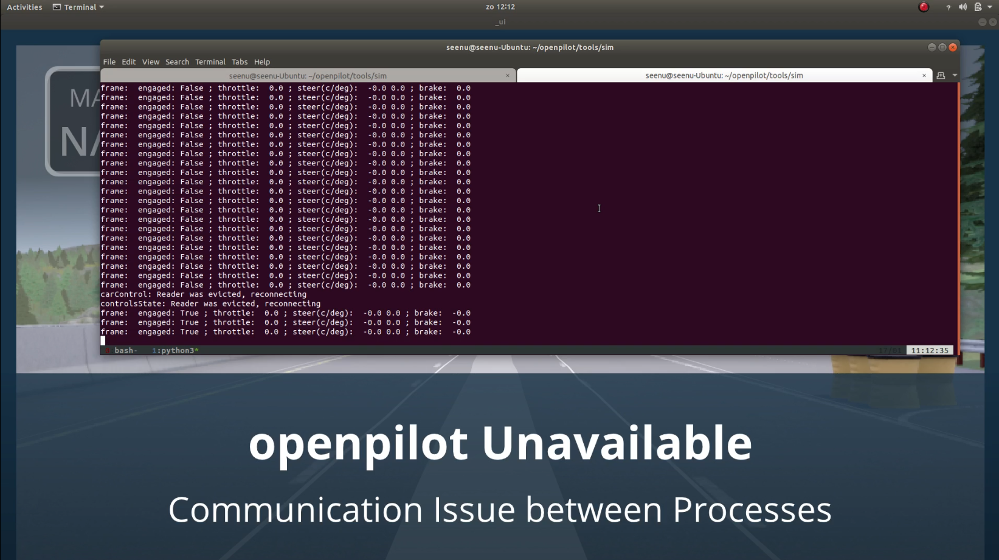

# ***Instructions for running openpilot and Carla.***
Follow the instruction provided to run the comma.ai simulation

Same instrcutions can be found on the PDF above.

Install Drivers and Software
The simulation runs on Ubuntu Platform Ubuntu 18 or above is preferred. 


### Install Docker

```
sudo apt install curl
curl https://get.docker.com | sh \
&& sudo systemctl start docker \
&& sudo systemctl enable docker
sudo docker run hello-world
```


### Install openpilot and carla
```
sudo apt install git
```
```
git clone https://github.com/commaai/openpilot.git  (Carla- runner branch is preferred)
``` 

which can be found in this link https://github.com/commaai/openpilot/tree/carla-runner 
```
cd openpilot/tools/sim
./install_carla.sh
Install drivers and start carla
sudo INSTALL=1 ./start_carla.sh 
```
This should start the Carla(for first time Pulling of required files will happen)

The simulation can be performed in two ways<br> 
> 1 Running the Simulation in Local host of PC with GPU<br>
> 2 Running the simulation completely in Docker<br>

The *First method* is preferred which is will work properly rather than running it in docker.<br>


### Running the Simulation in Local host of PC with GPU
For running the simulation on PC the following have to be verified \
>The Ubuntu_setup file in ‘tools’ folder has to be installed <br>
>Compile openpilot by running scons in the openpilot directory\
For video demo: https://youtu.be/i394nQOBS2U


For proper functioning of simulation, *CUDA*, *Cudnn*, and *onnxruntime-gpu* have to be installed.<br> 
Verify the installations using following commands
```
•	nvidia-smi ~ This shows the GPU and CUDA version
•	dpkg -l | grep cudnn ~ This shows Cudnn version
•	pip show will show the package version
 eg: pip show onnxruntime-gpu
```

*If all these are verified then the simulation is will work properly*


### For running simulation on PC
```
cd openpilot/tools/sim
sudo ./start_carla.sh
```
will start the CARLA which will pull required files and run-on Docker (the server can be hosted from the docker or it can be installed locally and configured, here docker is used). This part will be same for both running methods.


Open a new tab in the same terminal 
```
./launch_openpilot.sh 
```


Open the third tab in the same terminal 
```
./bridge.py
```


The screen should appear when this is done 


>In the bridge.py terminal press 1 to engage and increase speed<br>
Press 2 to lower the speed<br>
Press 3 to disengage the openpilot

Video Demo: https://youtu.be/_bZ5OLtvbhk

### Running openpilot on Docker 
Follow the following commands for running simulation on Docker<br>
```
cd openpilot/tools/sim \
sudo ./start_carla.sh \
```
This will start the CARLA which will pull required files and run-on Docker


Open a new tab in the same terminal
``` 
sudo ./start_openpilot_docker.sh 
```


This will start the Commai.ai simulation. Press 1 in terminal to engage.


*Video Demo + Trouble shooting:* https://youtu.be/VuEAiAwoTdY


## Tips and Troubleshooting
### "communication issue between processes"


disable the issue in controlsd.py few lines have to be commended out in the docker container.<br>


The file access in Docker will be little different 
back tick key (`) will be used for navigating the tabs

 this key is used for navigating

```
1)	`+0  this command will switch to launch_openpilot.sh tab
ctrl+c to kill process
ctrl +z to stop the execution
ctrl + d to exit the container
```
```
2)	`+1  will switch to bridge.py tab
(q) will quit the process
```
```
3)	`+c will add new tab (to access controlsd.py)
cd
cd /openpilot/selfdrive/controls
vim controlsd.py            (this will open the file in vim)
```
```
4)	Editing file in vim will be different than other editors type the following command in vim shell to comment out the lines 
:201,225s/^/#    press enter – This will comment out line from 201 to 225
:wq    press enter – this will save the file in vim 
```
```
5)	Navigate back to first tab and execute the ./launch_openpilot.sh then to second tab and execute ./bridge.py
```

***This will help to remove all the errors like communication error, planner error, and will enable the simulation on Docker. Note: This will not perform the auto pilot properly the car will move and crash.  Running the simulation on local machine with GPU will be proper***


### Carla scene is slow or fails to load in openpilot ui window
Try setting CARLA to the low quality rendering\

Open the file openpilot/tools/sim/start_carla.sh in the ubuntu file explorer
on the last line, add ./CarlaUE4.sh -quality-level=Low to the end of the docker command. 

It should look like the following:\
*docker run -it --net=host --gpus all carlasim/carla:0.9.7 ./CarlaUE4.sh -quality-level=Low*

### Docker service error
Every time the docker has to be closed and exited properly, if not it will throw error

```
Sudo docker ps ~ this will list the running dockers images
Sudo docker kill (id) ~ this will kill the running docker containers
``` 
Then restart the services again\
Video demo: https://youtu.be/ZilLvPYJ06o


>***Feel free to update additional troubleshooting or instrctions*** 


>***Thank you*** 